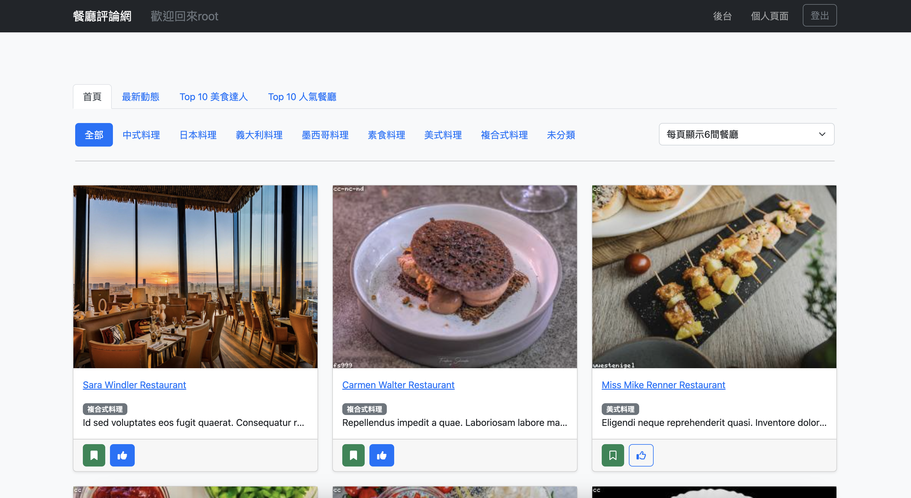

# README

[ 2023/3/7 更新]



## 功能：
一般使用者：
1. 註冊、登入帳號
2. 在首頁瀏覽所有餐廳 (可用分類篩選器)
3. 收藏、按讚、評論餐廳
4. 追蹤其他使用者
5. 編輯個人資料

管理員額外功能：
1. 新增、編輯、刪除餐廳
2. 更改使用者權限
3. 新增、編輯、刪除分類
4. 刪除使用者評論
---
## 開發工具

- Node.js 16.17.1
- Express 4.17.1
- Express-Handlebars 5.3.3
- Express-Session 1.17.3
- passport 0.4.1
- bcryptjs 2.4.3
- connect-flash 0.1.1
- multer 1.4.3
- imgur 1.0.2
- dayjs 1.11.7
- @faker-js/faker
- Bootstrap 5.2.2
- Font Awesome 6.2.1

## 資料庫 & ORM
- MySQL
- sequelize 6.6.5
- sequelize-cli 6.2.0
---
## 執行專案

請先確認有安裝 node.js、npm、nodemon

1. 將專案 clone 到本地

2. 在本地開啟之後，輸入：

   ```bash
   npm install
   ```

3. 透過終端機進入資料夾，輸入：

   ```bash
   npm run dev
   ```

4. 若看見此行訊息則代表順利運行，打開瀏覽器進入到以下網址

   ```bash
   Example app listening on port http://localhost:3000
   ```

5. 若欲暫停使用，至終端機輸入：
   ```bash
   ctrl + c
   ```

---
## 已註冊帳號

第一組帳號有 admin 權限：
  - email: root@example.com
  - password: 12345678

第二組帳號沒有 admin 權限：
  - email: user1@example.com
  - password: 12345678